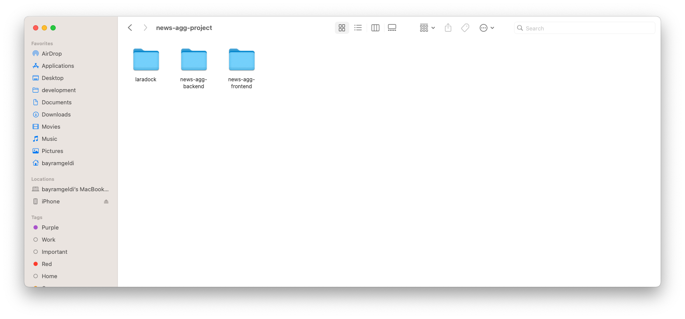
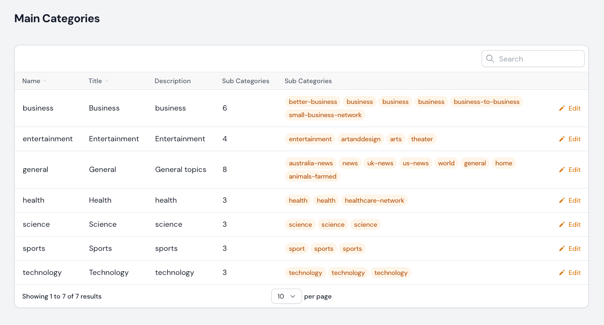
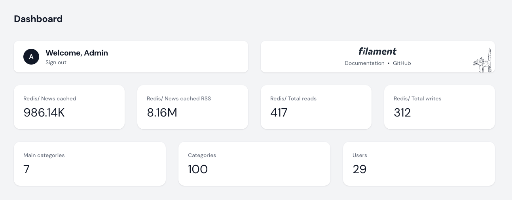
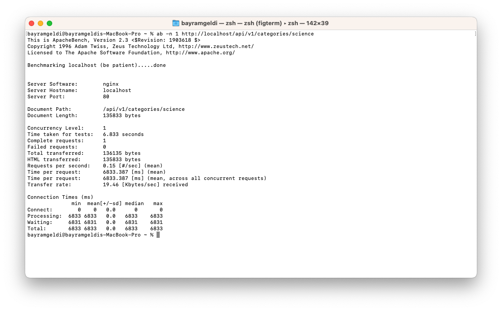
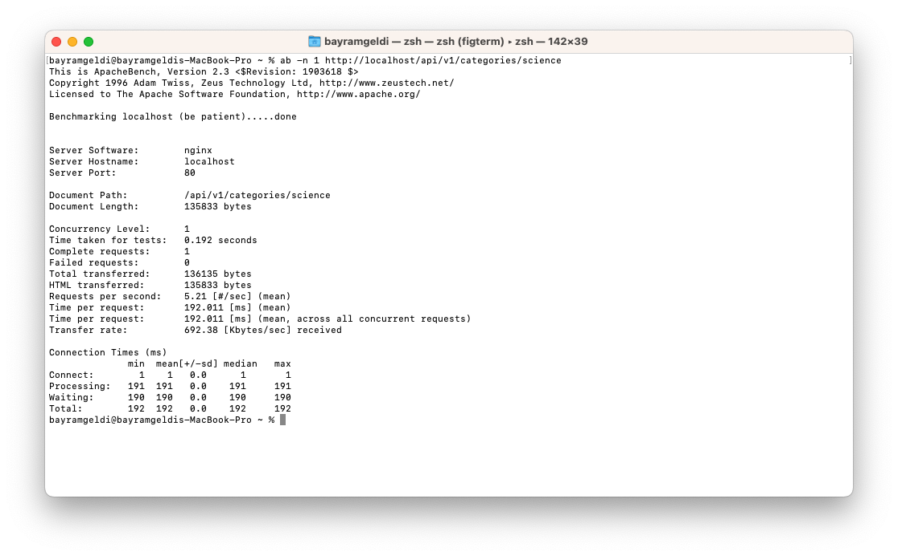

## About News Aggregator Project

This project is a news aggregator that collects news from different sources and displays them in a single page. The project is built using Laravel 10.10 and Reactjs 18.2.0. The project is still under development.
Whole project consists of three parts:
1. News Aggregator Backend https://github.com/bayramgeldi/news-agg-app
2. News Aggregator Frontend https://github.com/bayramgeldi/news-agg-frontend
3. News Aggregator Docker Configuration https://github.com/bayramgeldi/laradock/tree/dev-bayramgeldi


## Installation
After cloning the project repositories in to the same folder, structure should look like image below, you need to build and start the docker containers. For this, you need to follow the steps below:

1. Go to the laradock folder and copy the env-example file to .env

```bash cp env-example .env```
2. Open the .env file and make the following changes, this will be the path for the data:
```DATA_PATH_HOST=~/.laradock/data/news_agg_app```
3. Go to the laradock folder and run the following command:

```bash docker-compose up -d nginx mysql php-fpm workspace redis mailpit```
4. this command will start the docker containers that we are going to use in our project in the background, why I chose these containers?
      1. nginx - web server
      2. mysql - database
      3. php-fpm - php processor
      4. workspace - workspace
      5. redis - cache
5. After the containers are started, we need to go to the workspace container and install the project dependencies. For this, we need to run the following command:

```bash docker-compose exec workspace bash```
6. this command will open the workspace container, and we will be able to run commands in it
7. From here we need to go to the project folder and install the dependencies:

```bash cd news_agg_app```

```bash composer install```

```bash npm install```
8. After installing the dependencies, we need to create a database and run the migrations. For this, we need to run the following commands:

9. In this step we have to make sure that the environmental variables are set correct. Make sure you have obtained api keys for 
   1. ``NEWS_API_ORG_KEY`` and ``NEWS_API_ORG_URL``. You can get them from https://newsapi.org/
   2. ``THE_GUARDIAN_KEY`` and ``THE_GUARDIAN_URL``. You can get them from https://open-platform.theguardian.com/
   3. ``NEW_YORK_TIMES_KEY``, ``NEW_YORK_TIMES_SECRET`` and ``NEW_YORK_TIMES_URL``. You can get them from https://developer.nytimes.com/
10. After the user permission is set, we need to run the following command to generate the application key:

```bash php artisan key:generate```
```bash php artisan migrate```
11.After the migrations are completed, we need to seed the database with the following command:

```bash php artisan db:seed```
This step will create 10 test users, main categories and will fetch and save categories of news sources.
12. After the database is ready, we need to setup user permission to access the admin panel. For this, we need to go to User model and make changes on this line:

```php return str_ends_with($this->email, '@newsagg.app') && $this->hasVerifiedEmail();```
instead of "**newsagg.app**", you need to write your email domain name, or email address.

12. After permissiion is also set, now you can visit the admin panel by going to the following url:

```http://localhost/admin```

13. Now we can continue with setup of frontend part of the project. For this, we need to go to the frontend folder and copy the env-example file to .env

```bash cp env-example .env```
14. Install the dependencies:

```bash npm install```
15. After the dependencies are installed, we need to run the following command to start the frontend server:

```bash npm run start```
16. Or we can build the project and copy the build folder to the nginx container:

```bash npm run build```


## Usage
After the installation is completed, you can visit the frontend part of the project by going to the following url:

http://localhost from your browser. Here you will see the main page of the project. You can login to the project by clicking on the login button on the top right corner of the page or register new account. Email confirmation link will be collected in the mailpit container. You can visit the mailpit container by going to the following url: http://localhost:8125/
If you are logged in you can customize your news feed by selecting categories and news sources. You can also add new news sources and categories from the profile page. You can visit the profile page by going to the following url: http://localhost/profile


## Design 
On the design this design is used https://dribbble.com/shots/21678041-NewsHub-News-Website

## Decisions
1. I have decided to use laradock repository for docker configuration. I have used it before, and it is easy to configure and use.
2. I have decided to use redis and cache news for each category for 3 hours to reduce the number of api calls. This setting can be changed in the ``NewsSource`` ``TTL`` constant.
3. I have decided to use create admin panel because I noticed that each source had its own categories and I wanted to collect related categories under main categories. From admin panel admin can change main categories relation to sub categories.
    
   1. Also added stats about the Models and Redis to the admin panel.

### Sample benchmark results
1. I have used ``ab`` tool to benchmark the project. I have used the following command:
```bash ab -n 1  http://localhost/```
    
    
2. As you can see from the results, after the cache is implemented, the number of requests to the database is reduced from 10 to 1. Also the number of requests to the news sources is reduced from **`6833.387 ms`**  to **`192.011 ms`**. This will reduce the load on the news source apis.

